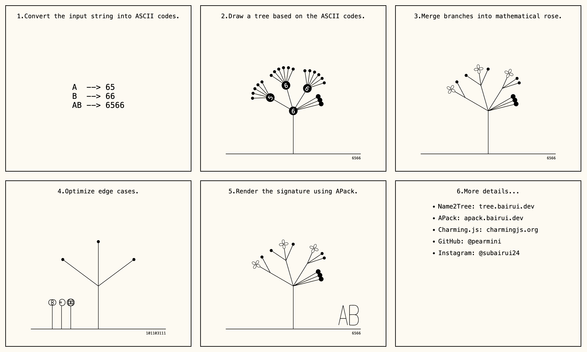

# Name2Tree: Find the Tree in You Name

"Find Your Name in the Tree" is an [online platform](https://tree.bairui.dev/) where you can transform your name into a tree and add it to a public archive with a stamp-style signature.

## Why？

This project explores digital identity by visualizing names as natural forms. It also experiments with writing English words within Chinese grid systems to create authorship art pieces.

## How？

- Convert the input name into ASCII or Unicode digits, which are numerical representations used by computers to encode characters.
- Use the resulting sequence of digits to generate a tree structure. Each digit becomes a node, and its value determines the number of child nodes it will have.
- Merge certain branches into [mathematical rose patterns](<https://en.wikipedia.org/wiki/Rose_(mathematics)>) for aesthetic appeal and to reduce visual clutter or overlap.
- Refine edge cases to ensure the tree appears natural and well-balanced — for example, condensing long sequences like multiple “10”s into a single rose shape to improve symmetry.
- Finally, transform the name into a signature using [APack](https://apack.bairui.dev/), like stamping the artwork with your identity to indicate its creator.

