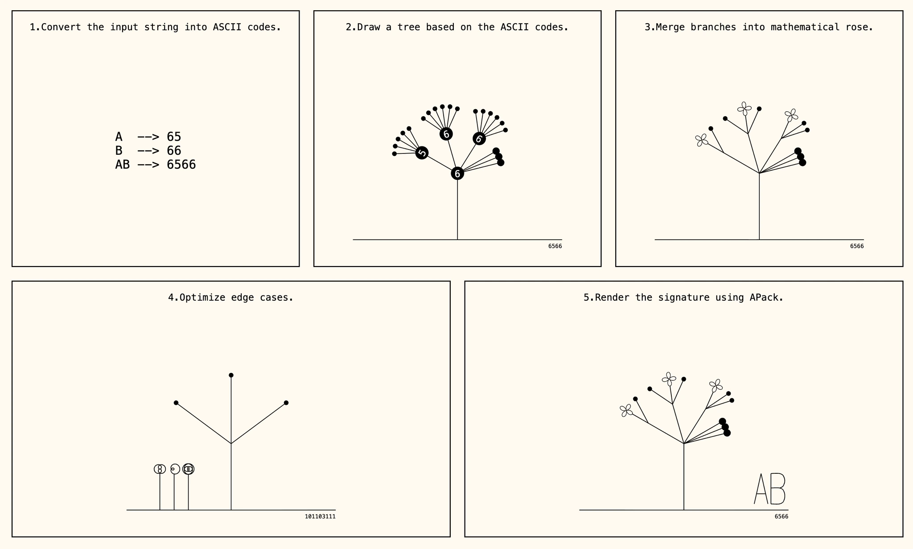
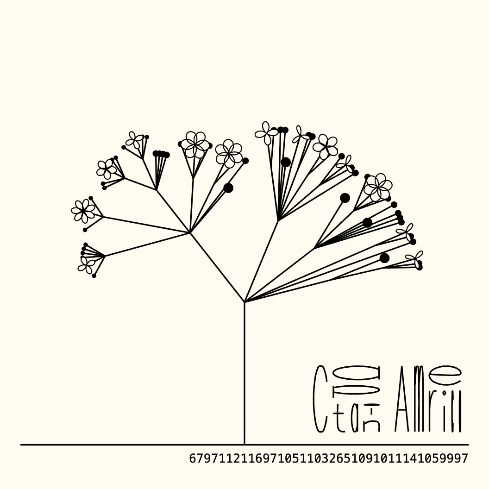
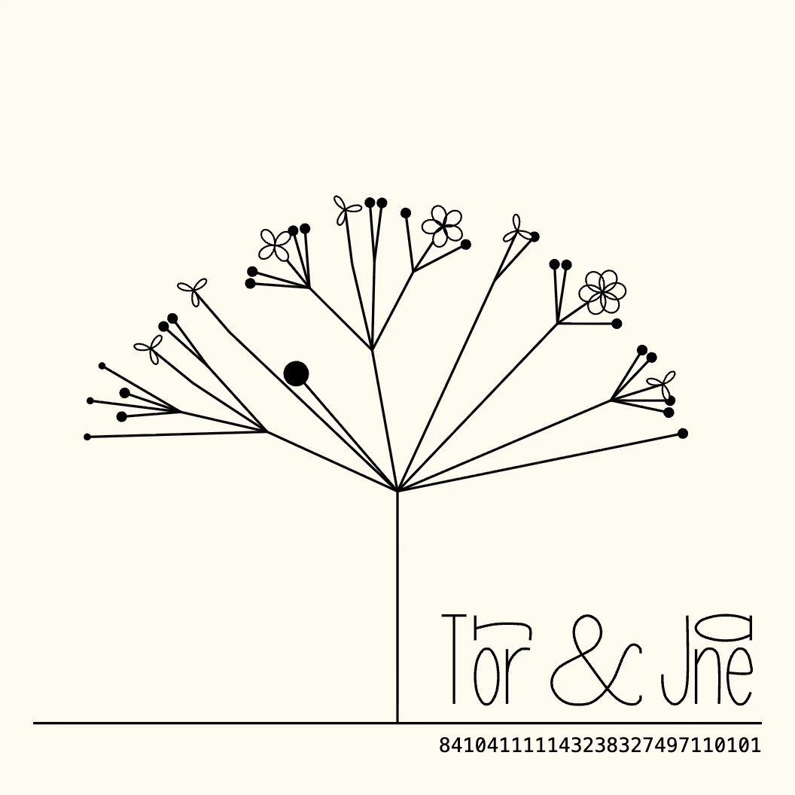
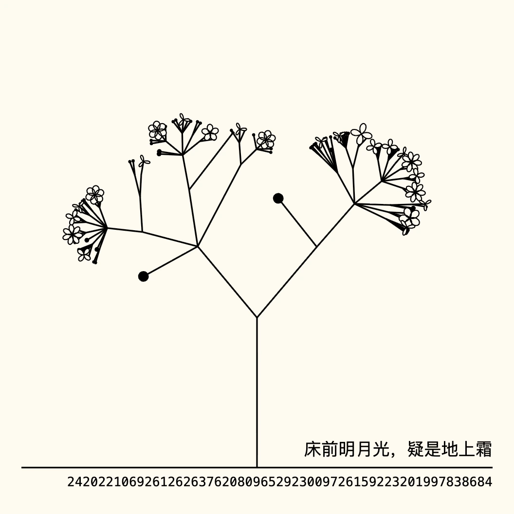
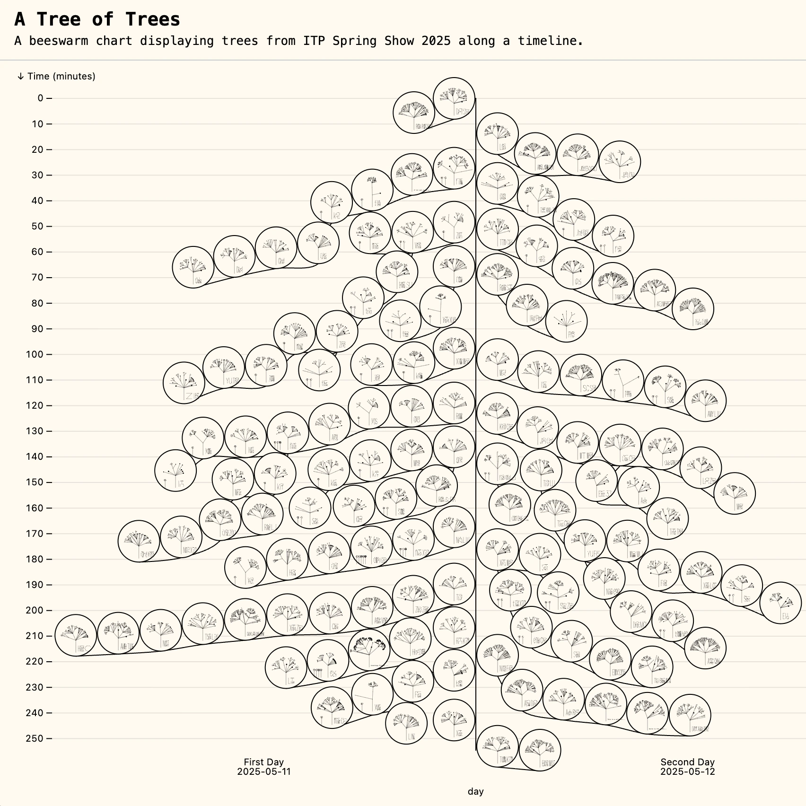

# Name2Tree

**Type a name. Grow a tree. Leave it in the forest.**

[](https://tree.bairui.dev/)
[](https://bairui.dev/name2tree)


Name2Tree is a generative art app that turns text into deterministic tree drawings. It began as the ITP Spring Show 2025 project [Find Trees in Names: What if We are Trees?](https://bairui.dev/name2tree), where visitors typed a name, watched a tree grow, added it to a shared forest, downloaded it through a QR flow, and printed it as a physical keepsake.

**You are welcome here.** Type your name or a short phrase on the [live app](https://tree.bairui.dev/), press **Add to Forest**, and your tree joins the community grove at the top of the forest — no GitHub pull request, just a moment between you and the algorithm.

> *The same words always grow the same tree. What will yours look like?*

[**Try it live →**](https://tree.bairui.dev/) · [**Explore the forest →**](https://tree.bairui.dev/forest) · [**Project story →**](https://bairui.dev/name2tree)

## What it does

1. **Type** — Enter a name, nickname, or any short text (validated for friendly content).
2. **Grow** — ASCII/Unicode digits drive a breadth-first tree; the same input always yields the same drawing.
3. **Add** — Community trees save to Supabase and appear first on [`/forest`](https://tree.bairui.dev/forest); the installation archive from `names.json` follows below.
4. **Keep** — Download PNG or SVG, scan a QR code for a print-ready page, or open collective views on `/viz`.
5. **Return** — Your community trees show a small mark; hover the card to reveal delete (only yours).

Degenerate digit runs become intentional flower-like roses. An APack stamp can sign the tree in a Chinese-character-like grid. Admin mode (`?admin=true`) still supports curating the bundled archive.



## Examples

These are trees generated from different text inputs. The input is not limited to names — poems, phrases, and numbers all become trees.

|  |  |  |
| --- | --- | --- |
|  |  |  |

## Why it exists

In Bairui Su's Chinese name, the character `柏` in the family name means cypress tree. That personal link sparked a question: what trees are hidden in other names?

Name2Tree treats language as both identity and data. By turning text into natural form, it makes code, authorship, and language visible — then extends into a shared forest, [swarm/cloud/grid visualizations](https://tree.bairui.dev/viz), [Tree Harmony](https://music.bairui.dev/tree), and the procedural landscape [{Mountains, Trees, Names}*](https://landscape.bairui.dev/).




## How it works

```
Your text
    │
    ▼
┌─────────────────────────────────────┐
│  Digitize (ASCII / Unicode codes)   │
│  Seeded RNG → breadth-first tree    │
│  Branch balance, roses for 1…0 runs │
└─────────────────────────────────────┘
    │
    ▼
┌─────────────────────────────────────┐
│  drawTree.js → SVG (Charming, Rough)│
│  Optional APack stamp, QR download  │
└─────────────────────────────────────┘
    │
    ├─ Add to Forest ──► Supabase `trees` (community, newest first)
    │
    └─ Archive ─────────► names.json (ITP show + bundled history, /viz only)
```

**Community layer** (`src/lib/`) — browser ID in `localStorage`, client validation, Supabase insert/delete with RLS. **Forest gallery** (`Forest.jsx`) — React grid of tree thumbnails. **Viz** (`drawForest.js`, D3, Observable Plot) — swarm, cloud, and grid layouts over the archive only.

## Tech stack

| Layer | Tools |
|-------|-------|
| UI | React 19, React Router, Vite |
| Drawing | D3, Observable Plot, Charming.js, Rough.js, `hachure-fill` |
| Stamp & QR | [APack](https://apack.bairui.dev/) (`apackjs`), `@awesomeqr/react` |
| Community forest | [Supabase](https://supabase.com/) — Postgres `trees` table, `@supabase/supabase-js`, Row Level Security |
| Validation | `bad-words` profanity filter, length and URL/email checks (client-side) |
| Deploy | Vercel |

Community add/delete uses the Supabase **anon** key in the browser (`VITE_SUPABASE_URL`, `VITE_SUPABASE_ANON_KEY`). Shared Supabase project `bairui-studio` can host more tables later (e.g. `faces` for [BioGlyph](https://bio.bairui.dev/)).

## Routes

| Path | Description |
|------|-------------|
| `/` | Generate a tree; add to the community forest or download |
| `/forest` | Community trees (Supabase) then archive (`names.json`); click to zoom |
| `/viz` | Swarm, cloud, or grid — **archive only** |
| `/write` | APack stamp writing (`?admin=true`) |
| `/about` | Project background |
| `/?text=...` | QR-linked download page for one tree |

## Getting started

**Requirements:** Node.js 18+, pnpm

```bash
git clone https://github.com/pearmini/name2tree.git
cd name2tree
pnpm install
cp .env.example .env.local   # optional: enable Add to Forest via Supabase
pnpm dev
```

Open [http://localhost:5173](http://localhost:5173). Without `.env.local`, the app runs; community add shows a friendly “not connected” message.

```bash
pnpm build     # production build
pnpm preview   # preview production build
pnpm lint      # ESLint
pnpm clean     # dedupe names.json
```

### Supabase setup (community forest)

1. Run [`supabase/trees.sql`](supabase/trees.sql) in the Supabase SQL Editor.
2. Set `VITE_SUPABASE_URL` and `VITE_SUPABASE_ANON_KEY` in `.env.local` and on Vercel.

## Project structure

```
name2tree/
├── src/
│   ├── App.jsx           # Routes, archive vs community state
│   ├── Tree.jsx          # Main generator + Add to Forest
│   ├── Forest.jsx        # Gallery, own-tree delete on hover
│   ├── drawTree.js       # Text → tree algorithm
│   ├── drawForest.js     # Swarm / cloud / grid layouts
│   ├── Viz.jsx           # Visualization route
│   ├── names.json        # Bundled installation archive
│   └── lib/
│       ├── supabase.js   # Client + browser ID header
│       ├── treesApi.js   # Fetch / add / delete community trees
│       └── validateName.js
├── supabase/
│   └── trees.sql         # Schema + RLS
└── img/
```

Admin shortcuts on `/forest` with `?admin=true`: save, download, clear, remove, upload `names.json` (archive only).

## Related work

- [tree.bairui.dev](https://tree.bairui.dev/) — live app
- [bairui.dev/name2tree](https://bairui.dev/name2tree) — documentation
- [{Mountains, Trees, Names}*](https://landscape.bairui.dev/) — landscape
- [Tree Harmony](https://music.bairui.dev/tree) — sound
- [BioGlyph](https://bio.bairui.dev/) — one-line faces (sibling project on shared Supabase)

## License

[MIT](./LICENSE)

<p align="center">
  <a href="https://tree.bairui.dev/"><strong>tree.bairui.dev</strong></a>
  &nbsp;·&nbsp;
  <a href="https://github.com/pearmini/name2tree">Source</a>
  &nbsp;·&nbsp;
  <a href="https://bairui.dev/">Blog</a>
</p>

<p align="center"><em>What if we are trees?</em></p>
